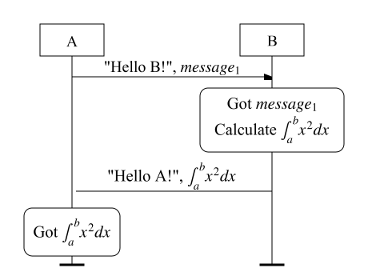

# Proto Sketch - Protocol Flowchart Tool

🌏 [English](README.md) | [简体中文](README.zh-CN.md)


## Project Overview 🏷️

Proto Sketch is a Python-based protocol flowchart tool that automatically generates clear and visually appealing protocol diagrams using a custom description language. It addresses the following challenges:

- Eliminates positioning frustrations when using tools like PPT
- Avoids complex LaTeX drawing syntax
- Provides sufficient customization while maintaining simplicity

## Key Features ✨

- **Concise Description Language**: Easy-to-write protocol descriptions
- **LaTeX Math Support**: Embed LaTeX formulas directly in messages
- **Auto Layout**: Intelligent automatic arrangement of elements with manual adjustment support
- **Multi-format Export**: Supports PNG, SVG, PDF (currently SVG only)
- **High Customizability**: Adjust colors, fonts, arrow styles, etc. (coming soon)
- **Code Control**: Precise control over every detail through code

## Quick Start 🚀

### Installation

```bash
pip install https://github.com/OccDeser/proto-sketch/releases/download/v0.1.5/proto_sketch-0.1.5-py3-none-any.whl
```

### Basic Usage

1. Create a protocol description file (e.g., `demo.proto`):

    ```proto
    # Simple request-response example
    protocol demo

    actor A
    actor B

    A->B:
        "\"Hello B!\", $message_1$"

    B:
    "
        Got $message_1$
        Calculate $\int_{a}^{b} x^2 dx$
    "

    B->A:
        "\"Hello A!\", $\int_{a}^{b} x^2 dx$"

    A:
        "Got $\int_{a}^{b} x^2 dx$"
    ```

2. Generate the flowchart using CLI:

    ```bash
    proto-sketch -f demo.proto -d -o demo.svg
    ```

3. View the generated `demo.svg` file

    

## Description Language Syntax 📜

Proto Sketch uses concise syntax for protocol description:

```plaintext
protocol <ProtocolName>  # Protocol declaration

actor <Participant>      # Define participant

<Sender>-><Receiver>:    # Message transfer
    "<MessageContent>"

<Participant>:           # Local event
    "<EventDescription>"
```

**Syntax Notes**:
1. Content wrapped in `$` will be parsed as LaTeX formula
2. Strings require double quotes with internal quotes escaped
3. Supports multi-line local events (direct line breaks or using `\n` for new lines)

## Development Roadmap 🗺️
- [x] Basic syntax parser 🧩
- [x] SVG rendering engine 🖍️
- [ ] Visual editor interface 💻
- [ ] Style customization module 🎨
- [ ] Multi-format export (PDF/PNG) 📤

## License ⚖️

Licensed under MIT - See [LICENSE](LICENSE) for details.