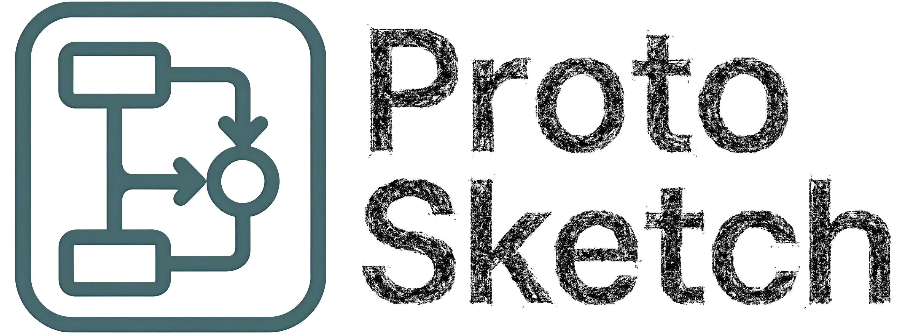

# Proto Sketch - 协议流程绘制工具

🌏 [English](README.md) | [简体中文](README.zh-CN.md)



## 项目简介 🏷️

Proto Sketch 是一个基于 Python 的协议流程绘制工具，它通过自定义的协议描述语言，自动生成清晰美观的协议流程图。该项目旨在解决以下问题：

- 避免使用 PPT 等工具时无法精确控制图形位置的困扰
- 摆脱 LaTeX 绘图时的繁琐语法
- 在保持简洁性的同时提供足够的自定义控制能力

## 主要特性 ✨

- **简洁的描述语言**：使用易于编写的描述协议流程
- **LaTeX 数学公式支持**：在消息内容中直接嵌入 LaTeX 公式
- **自动布局**：智能自动排列流程图元素，同时支持手动调整
- **多格式输出**：支持 PNG、SVG、PDF 等多种输出格式（当前版本仅支持 SVG）
- **高度可定制**：可调整颜色、字体、箭头样式等视觉元素（待实现）
- **代码控制**：可通过代码精确控制每个细节

## 快速开始 🚀

### 安装

```bash
pip install https://github.com/OccDeser/proto-sketch/releases/download/v0.1.5/proto_sketch-0.1.5-py3-none-any.whl
```

### 基本使用

1. 创建一个协议描述文件 (例如 `demo.proto`):

    ```proto
    # 简单请求-响应协议示例
    protocol demo

    actor A
    actor B

    A->B:
        "\"Hello B!\", $message_1$"

    B:
    "
        Got $message_1$
        Calculate $\int_{a}^{b} x^2 dx$
    "

    B->A:
        "\"Hello A!\", $\int_{a}^{b} x^2 dx$"

    A:
        "Got $\int_{a}^{b} x^2 dx$"
    ```

2. 使用命令行工具生成流程图:

    ```bash
    proto-sketch -f demo.proto -d -o demo.svg
    ```

3. 查看生成的 `demo.svg` 文件

    

## 协议描述语言语法 📜

Proto Sketch 使用简洁的语法描述协议流程：

```plaintext
protocol <协议名称>  # 协议声明

actor <参与者>      # 定义参与者

<发送方>-><接收方>:  # 消息传递
    "<消息内容>"

<参与者>:           # 本地事件
    "<事件描述>"
```

**语法说明**：
1. 使用`$` 包裹的内容会被解析为 LaTeX 公式
2. 字符串需用双引号包裹，内部引号需转义
3. 支持多行本地事件(直接换行或使用 `\n` 换行符)

## 开发路线图 🗺️
- [x] 基础语法解析器 🧩
- [x] SVG 图形生成 🖍️
- [ ] 可视化编辑器 💻
- [ ] 样式自定义模块 🎨
- [ ] 多格式导出（PDF/PNG） 📤

## 许可证 ⚖️

本项目采用 MIT 许可证 - 详情请参阅 [LICENSE](LICENSE) 文件。